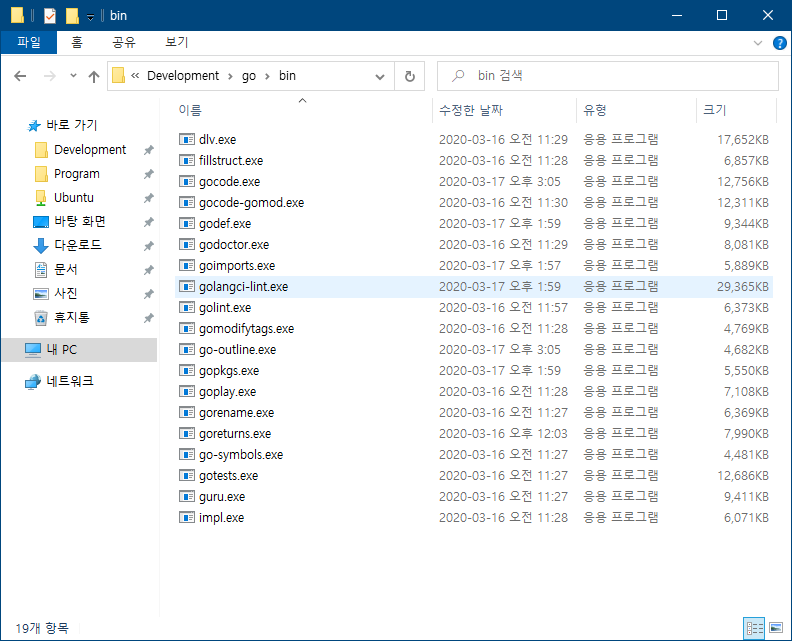
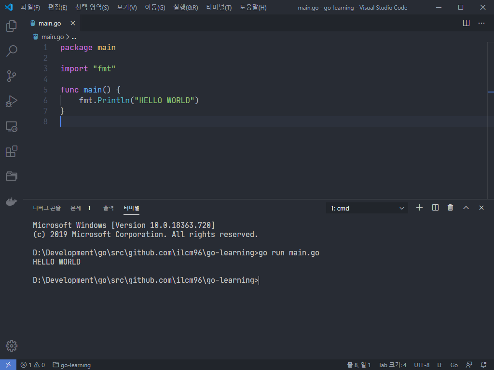

# Requirement

- VSCode
- 기본적인 윈도우 환경 변수 설정 방법

# 1. Go 다운로드

[공식 홈페이지](https://golang.org/dl/#featured)에 가서 `go*.windows-amd64.msi`라고 적힌 것을 다운로드 하고 설치한다.
설치 위치는 기본 위치인 `C:\Go`에 하면 된다.

# 2. 환경 변수 설정

> 세세한 환경 변수 설정 방법은 https://ilcm96.me/2020-02-01-flutter-dev-env-setup#2-환경변수-설정 를 참고

1. 먼저 시스템 변수의 PATH에 `C:\Go\bin`를 추가한다.
2. USER 환경 변수에 `GOROOT` 항목을 추가하고 변수 값으로는 `C:\Go`를 입력한다.
3. `GOPATH` 항목이 존재한다면 삭제한다. (VSCode에서 설정할 예정)

다 설정하고 나서 CMD를 열고 `go version`을 입력해서 버전이 정상적으로 출력된다면 잘 설정된 것이다.

```
C:\Users\ilcm96>go version
go version go1.14 windows/amd64
```

# 3. 개발할 폴더 정하기

Go는 Python이나 JS처럼 아무 폴더나 만들어서 그 안에서 개발하는 방식이 아니다.  
`GOPATH`로 지정된 폴더 안에 `bin`, `pkg`, `src` 폴더를 만들고 src 폴더 안에서 개발하는 방식이다.  
즉 다른 폴더에서 개발할 때마다 `GOPATH`의 값을 바꿔야 하는데, 귀찮기 때문에 각 폴더안에 VSCode의 설정 파일인 `settings.json`을 통해 `GOPATH`를 지정할 것이다.

1. 먼저 개발할 폴더를 정한다 (필자는 `go`라는 폴더를 만들었다)
2. 그 폴더 안에 `bin`, `pkg`, `src` 폴더를 만든다.
3. 코드를 Github에 푸시할 생각이 있다면 `src/gitub.com/userName/repoName`의 형태로 폴더를 만든다.

```
go
├── bin
├── pkg
└── src
    └── github.com
        └── ilcm96
            └── go-learning
```

4. 코드를 푸시할 생각이 없다면 `src/someFolder`의 형태로 만든다.

```
go
├── bin
├── pkg
└── src
    └── go-learning
```

> **Tip)** bin, pkg, src를 포함하는 폴더(go)를 백신에 예외처리 하는게 좋다 (아직 유저가 적어서 그런지 오진이 많다)

# 4. VSCode 설정

1. Go 확장을 설치한다.  
   
2. 위 예시에 **go-learning**에 해당하는 폴더를 열고 `.vscode/settings.json`파일을 만든다.  
   전역 `settings.json`에 설정하는 것이 아니라 폴더 안에 따로 만드는 이유는 다른 폴더에서 Go 개발을 할때는, 위에서도 설명했듯이 다시 `GOPATH`를 설정해줘야 하기 때문이다.
3. `settings.json` 파일을 다음과 같이 수정한다.  
   bin, pkg, src를 포함하는 폴더를 `D:\\Development\\go` 대신 넣으면 된다

   ```
   // go/src/github.com/ilcm96/go-learing

   {
     "go.gopath": "D:\\Development\\go"
   }
   ```

4. `main.go`를 만들고 입력을 시작하면 우측 하단에 여러 툴을 설치하라는 메세지가 나오는데 이때 **Install All**을 눌러서 다 설치하면 된다.  
   설치한 후 `bin` 폴더를 보면 설치한 툴의 exe 파일이 있는것을 볼 수 있다.
   

# 5. 코드 실행

코드 실행은 터미널을 열고 `go run main.go` 등으로 실행하면 된다.


